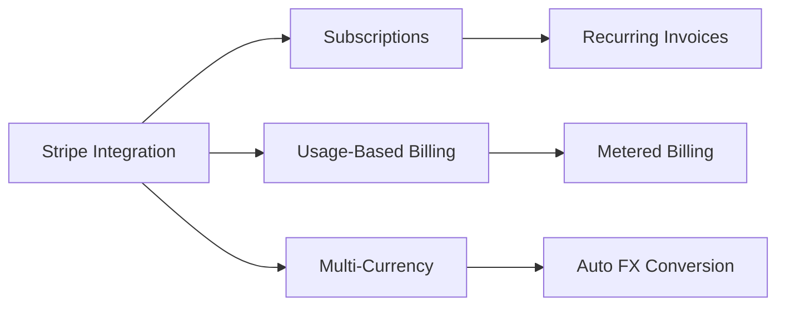
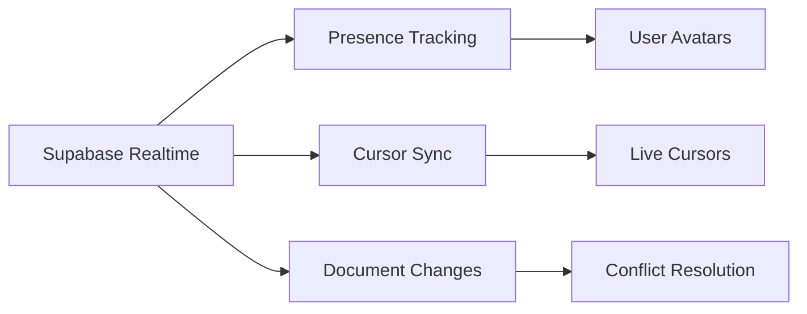
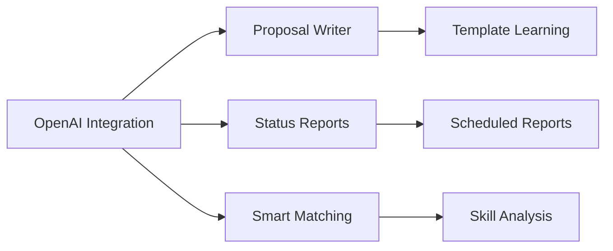

# FreeFlow Feature Gap Analysis

> **Comprehensive competitive analysis and feature roadmap for closing gaps against industry leaders**
>
> Last Updated: January 2026

---

## Executive Summary

FreeFlow is a comprehensive freelancer management and creative collaboration platform with **225 dashboard pages**, **746 custom hooks**, and **209 API routes**. While the platform has extensive feature coverage, this analysis identifies **critical gaps** when compared to market leaders across multiple categories.

### Key Competitors Analyzed

| Category | Competitors |
|----------|-------------|
| **Freelancer Platforms** | Fiverr, Upwork, Toptal, Contra |
| **Project Management** | Monday.com, Asana, ClickUp, Notion |
| **Creative Collaboration** | Figma, Frame.io, DaVinci Resolve |
| **Invoicing & Billing** | FreshBooks, QuickBooks, Wave, Stripe |
| **Client Management** | Dubsado, HoneyBook, Capsule |
| **Time Tracking** | Toggl Track, Harvest, Clockify |
| **CRM** | HubSpot, Salesforce |
| **Payments** | Stripe, Payoneer, Wise, Escrow.com |

---

## Gap Analysis by Category

### 1. Payment & Billing Gaps

#### Current FreeFlow Status
- Basic invoicing system
- Escrow payment support
- Crypto payments (basic)
- Transaction management

#### Critical Gaps to Close

| Gap | Priority | Competitor Reference | Implementation Effort |
|-----|----------|---------------------|----------------------|
| **Zero-Fee Payment Model** | HIGH | Contra (0% commission) | Medium |
| **Usage-Based Billing** | HIGH | Stripe Billing | Medium |
| **Recurring Subscriptions** | HIGH | FreshBooks, Stripe | Medium |
| **Auto-Generated Invoices from Time Tracking** | HIGH | Harvest | Low |
| **Multi-Currency Support** | HIGH | Wise, Payoneer | Medium |
| **Payment Method Variety** | MEDIUM | Stripe (ACH, SEPA, Boleto) | Medium |
| **Milestone-Based Payments** | MEDIUM | Upwork | Low |
| **Dispute Resolution System** | HIGH | Escrow.com, Upwork | High |
| **Tax Calculation & Compliance** | HIGH | Stripe Tax | High |
| **Invoice Financing** | LOW | Wave, FreshBooks | High |

#### Recommended Implementation

```typescript
// Stripe Usage-Based Billing Integration
// File: app/api/billing/subscriptions/route.ts

import Stripe from 'stripe';

export async function POST(req: Request) {
  const stripe = new Stripe(process.env.STRIPE_SECRET_KEY!);
  const { customerId, priceId, billingMode } = await req.json();

  const subscription = await stripe.subscriptions.create({
    customer: customerId,
    items: [{ price: priceId }],
    payment_behavior: 'default_incomplete',
    billing_mode: { type: billingMode }, // 'flexible' for usage-based
    expand: ['latest_invoice.confirmation_secret'],
  });

  return Response.json({
    subscriptionId: subscription.id,
    clientSecret: subscription.latest_invoice?.confirmation_secret?.client_secret,
  });
}
```

---

### 2. Real-Time Collaboration Gaps

#### Current FreeFlow Status
- Collaboration Hub (basic)
- Canvas Collaboration
- Voice Collaboration
- Real-time presence indicators

#### Critical Gaps to Close

| Gap | Priority | Competitor Reference | Implementation Effort |
|-----|----------|---------------------|----------------------|
| **True Real-Time Co-Editing** | HIGH | Figma, Google Docs | High |
| **Timestamped Video Comments** | HIGH | Frame.io | Medium |
| **Version Comparison (Side-by-Side)** | HIGH | Frame.io, DaVinci Resolve | Medium |
| **Multi-User Timeline Editing** | MEDIUM | DaVinci Resolve 20 | High |
| **Cursor Presence & Names** | HIGH | Figma | Low |
| **Conflict Resolution** | HIGH | Notion, Figma | High |
| **Offline Mode with Sync** | MEDIUM | Notion | High |
| **Camera-to-Cloud Integration** | LOW | Frame.io + Canon | High |

#### Recommended Implementation

```typescript
// Supabase Realtime Presence Tracking
// File: lib/hooks/use-realtime-collaboration.ts

import { useEffect, useState } from 'react';
import { createClient } from '@/lib/supabase/client';

interface Presence {
  user_id: string;
  user_name: string;
  cursor: { x: number; y: number };
  color: string;
  online_at: string;
}

export function useRealtimeCollaboration(documentId: string) {
  const [presences, setPresences] = useState<Map<string, Presence>>(new Map());
  const supabase = createClient();

  useEffect(() => {
    const channel = supabase.channel(`document:${documentId}`, {
      config: {
        broadcast: { self: true, ack: true },
        presence: { key: 'user_id' },
      },
    });

    channel
      .on('presence', { event: 'sync' }, () => {
        const state = channel.presenceState<Presence>();
        const newPresences = new Map<string, Presence>();
        Object.entries(state).forEach(([key, value]) => {
          if (value[0]) newPresences.set(key, value[0]);
        });
        setPresences(newPresences);
      })
      .subscribe(async (status) => {
        if (status === 'SUBSCRIBED') {
          await channel.track({
            user_id: 'current-user-id',
            user_name: 'Current User',
            cursor: { x: 0, y: 0 },
            color: '#' + Math.floor(Math.random()*16777215).toString(16),
            online_at: new Date().toISOString(),
          });
        }
      });

    return () => {
      channel.unsubscribe();
    };
  }, [documentId, supabase]);

  return { presences };
}
```

---

### 3. Project Management Gaps

#### Current FreeFlow Status
- Projects Hub (comprehensive)
- Sprints & Milestones
- Kazi Workflows (automation)
- Time Tracking
- Capacity Planning

#### Critical Gaps to Close

| Gap | Priority | Competitor Reference | Implementation Effort |
|-----|----------|---------------------|----------------------|
| **AI-Generated Project Status Reports** | HIGH | Asana Intelligence | Medium |
| **Multiple Assignees per Task** | MEDIUM | ClickUp | Low |
| **Map View (Geographic)** | LOW | ClickUp | Medium |
| **Mind Mapping** | MEDIUM | ClickUp | Medium |
| **Workload Balancing Automation** | HIGH | Monday.com | High |
| **Goals & OKR Tracking** | HIGH | Asana, ClickUp | Medium |
| **Time Estimates vs Actual Tracking** | HIGH | Harvest | Low |
| **Gantt Chart with Dependencies** | MEDIUM | Asana, Monday.com | Medium |
| **Custom Field Types (More Variety)** | MEDIUM | ClickUp | Low |
| **Board-Level Automations** | HIGH | Monday Magic (AI) | High |

#### Recommended Implementation

```typescript
// AI-Generated Project Status Reports
// File: app/api/ai/project-status/route.ts

import { OpenAI } from 'openai';
import { createClient } from '@/lib/supabase/server';

export async function POST(req: Request) {
  const { projectId } = await req.json();
  const supabase = await createClient();
  const openai = new OpenAI();

  // Fetch project data
  const { data: project } = await supabase
    .from('projects')
    .select(`
      *,
      tasks(*),
      milestones(*),
      time_entries(*)
    `)
    .eq('id', projectId)
    .single();

  const completion = await openai.chat.completions.create({
    model: 'gpt-4o',
    messages: [
      {
        role: 'system',
        content: 'You are a project management AI. Generate a concise status report.',
      },
      {
        role: 'user',
        content: `Generate a status report for this project data: ${JSON.stringify(project)}`,
      },
    ],
  });

  return Response.json({
    report: completion.choices[0].message.content,
    generatedAt: new Date().toISOString(),
  });
}
```

---

### 4. Client Portal Gaps

#### Current FreeFlow Status
- Client Portal (basic)
- Client Zone
- Client management

#### Critical Gaps to Close

| Gap | Priority | Competitor Reference | Implementation Effort |
|-----|----------|---------------------|----------------------|
| **White-Labeled Client Portal** | HIGH | Dubsado, HoneyBook | Medium |
| **Client Self-Service Booking** | HIGH | HoneyBook, Calendly | Medium |
| **Automated Onboarding Workflows** | HIGH | Dubsado | Medium |
| **E-Signature Integration** | HIGH | Dubsado, DocuSign | Medium |
| **Client Approval Workflows** | HIGH | Frame.io | Medium |
| **Project Timeline Visibility** | MEDIUM | HoneyBook | Low |
| **Custom Branding per Client** | MEDIUM | Dubsado | Medium |
| **Client Questionnaires** | MEDIUM | Dubsado, HoneyBook | Low |
| **Automated Reminders (SMS/Email)** | HIGH | HoneyBook | Medium |
| **Client Satisfaction Surveys** | MEDIUM | HoneyBook | Low |

#### Impact Statistics
> Clients using portals report **42% higher satisfaction scores**. 78% of freelance clients would choose a freelancer with a professional portal over one without, even at **10-15% higher rates**.

---

### 5. Time Tracking Gaps

#### Current FreeFlow Status
- Time Tracking (basic)
- Time entries linked to projects

#### Critical Gaps to Close

| Gap | Priority | Competitor Reference | Implementation Effort |
|-----|----------|---------------------|----------------------|
| **Pomodoro Timer** | MEDIUM | Toggl Track | Low |
| **Idle Time Detection** | MEDIUM | Toggl Track | Medium |
| **Browser Extension (100+ integrations)** | HIGH | Toggl Track | High |
| **Auto Time Tracking** | HIGH | Toggl Track | High |
| **Billable Rate Management** | HIGH | Harvest | Low |
| **Timesheet → Invoice Conversion** | HIGH | Harvest | Medium |
| **GPS Tracking (Mobile)** | LOW | Clockify | High |
| **Screenshot Recording** | LOW | Clockify | High |
| **Profitability Reports per Task** | HIGH | Harvest | Medium |
| **Team Time Visibility** | MEDIUM | Clockify | Low |

#### Recommended Implementation

```typescript
// Timesheet to Invoice Conversion
// File: lib/hooks/use-timesheet-invoice.ts

import { useCallback } from 'react';
import { createClient } from '@/lib/supabase/client';

export function useTimesheetToInvoice() {
  const supabase = createClient();

  const convertToInvoice = useCallback(async (clientId: string, dateRange: { start: Date; end: Date }) => {
    // Get unbilled time entries for client
    const { data: timeEntries } = await supabase
      .from('time_entries')
      .select(`
        *,
        project:projects(name, hourly_rate),
        user:users(name, hourly_rate)
      `)
      .eq('client_id', clientId)
      .eq('invoiced', false)
      .gte('date', dateRange.start.toISOString())
      .lte('date', dateRange.end.toISOString());

    // Calculate totals
    const lineItems = timeEntries?.map((entry) => ({
      description: `${entry.project.name} - ${entry.description}`,
      quantity: entry.hours,
      rate: entry.project.hourly_rate || entry.user.hourly_rate,
      amount: entry.hours * (entry.project.hourly_rate || entry.user.hourly_rate),
    }));

    // Create invoice
    const { data: invoice } = await supabase
      .from('invoices')
      .insert({
        client_id: clientId,
        line_items: lineItems,
        total: lineItems?.reduce((sum, item) => sum + item.amount, 0),
        status: 'draft',
        generated_from: 'timesheet',
      })
      .select()
      .single();

    // Mark time entries as invoiced
    await supabase
      .from('time_entries')
      .update({ invoiced: true, invoice_id: invoice?.id })
      .in('id', timeEntries?.map((e) => e.id) || []);

    return invoice;
  }, [supabase]);

  return { convertToInvoice };
}
```

---

### 6. AI & Automation Gaps

#### Current FreeFlow Status
- AI Assistant (GPT-4o, Claude)
- AI Image Generator (Nano Banana)
- AI Music Studio (Suno)
- AI Video Studio (Veo 3)
- Kazi Workflows
- Kazi Automations

#### Critical Gaps to Close

| Gap | Priority | Competitor Reference | Implementation Effort |
|-----|----------|---------------------|----------------------|
| **AI Proposal Writer** | HIGH | Upwork Uma AI | Medium |
| **Smart Job Matching** | HIGH | Contra Indy AI | High |
| **AI-Powered Board Creation** | HIGH | Monday Magic | Medium |
| **No-Code App Builder** | MEDIUM | Monday Vibe | High |
| **Contextual AI Assistant** | HIGH | Monday Sidekick | Medium |
| **7,000+ App Integrations** | HIGH | Zapier | Very High |
| **AI Workflow Suggestions** | HIGH | Make.com | Medium |
| **Predictive Analytics** | HIGH | Microsoft Copilot | High |
| **Natural Language Automation** | HIGH | Notion AI | High |
| **AI Email Summarization** | MEDIUM | Notion AI | Low |

#### Recommended Implementation

```typescript
// AI Proposal Writer
// File: app/api/ai/proposal-writer/route.ts

import { OpenAI } from 'openai';
import { createClient } from '@/lib/supabase/server';

export async function POST(req: Request) {
  const { jobDescription, userId } = await req.json();
  const supabase = await createClient();
  const openai = new OpenAI();

  // Fetch user's portfolio and past work
  const { data: profile } = await supabase
    .from('users')
    .select(`
      *,
      projects:projects(title, description, client_feedback),
      skills:user_skills(skill_name, proficiency)
    `)
    .eq('id', userId)
    .single();

  const completion = await openai.chat.completions.create({
    model: 'gpt-4o',
    messages: [
      {
        role: 'system',
        content: `You are an expert freelance proposal writer. Write compelling, personalized proposals that highlight the freelancer's relevant experience and skills.`,
      },
      {
        role: 'user',
        content: `
          Write a proposal for this job:
          ${jobDescription}

          Freelancer profile:
          ${JSON.stringify(profile)}

          Make it personal, specific, and highlight relevant past work.
        `,
      },
    ],
    temperature: 0.7,
  });

  return Response.json({
    proposal: completion.choices[0].message.content,
    tone: 'professional',
    estimatedReadTime: '2 min',
  });
}
```

---

### 7. Marketplace & Discovery Gaps

#### Current FreeFlow Status
- Marketplace (basic)
- App Store
- Theme Store
- Plugin system

#### Critical Gaps to Close

| Gap | Priority | Competitor Reference | Implementation Effort |
|-----|----------|---------------------|----------------------|
| **Freelancer Talent Search** | HIGH | Upwork, Toptal | High |
| **Skill-Based Matching Algorithm** | HIGH | Toptal (top 3%) | High |
| **Client Reviews & Ratings** | HIGH | Fiverr, Upwork | Medium |
| **Portfolio Showcases** | HIGH | Contra | Medium |
| **Job Board Integration** | HIGH | Upwork | High |
| **Gig Listings** | HIGH | Fiverr | Medium |
| **Verified Profiles** | MEDIUM | Toptal | Medium |
| **Success Score/Rating** | HIGH | Upwork JSS | High |
| **Featured Freelancer Program** | MEDIUM | Fiverr Pro | Medium |
| **Category-Specific Discovery** | MEDIUM | All platforms | Medium |

---

### 8. CRM & Sales Gaps

#### Current FreeFlow Status
- CRM (basic)
- Clients management
- Sales pipeline
- Lead Generation

#### Critical Gaps to Close

| Gap | Priority | Competitor Reference | Implementation Effort |
|-----|----------|---------------------|----------------------|
| **Marketing Hub Integration** | HIGH | HubSpot | High |
| **Email Sequences/Drip Campaigns** | HIGH | HubSpot | Medium |
| **Landing Page Builder** | MEDIUM | HubSpot | High |
| **Lead Scoring** | HIGH | Salesforce, HubSpot | High |
| **Deal Pipeline Visualization** | MEDIUM | HubSpot | Medium |
| **Contact Activity Timeline** | HIGH | HubSpot | Medium |
| **Email Tracking (Opens/Clicks)** | HIGH | HubSpot | Medium |
| **Meeting Scheduler** | HIGH | HubSpot, Calendly | Medium |
| **Live Chat Widget** | MEDIUM | HubSpot | Medium |
| **AI-Powered Lead Insights** | MEDIUM | Salesforce Einstein | High |

---

### 9. Video & Creative Tool Gaps

#### Current FreeFlow Status
- Video Studio (basic)
- Audio Studio
- AI Video Generation (Veo 3)
- Canvas
- Gallery

#### Critical Gaps to Close

| Gap | Priority | Competitor Reference | Implementation Effort |
|-----|----------|---------------------|----------------------|
| **Blackmagic Cloud Integration** | MEDIUM | DaVinci Resolve | Very High |
| **Node-Based Color Grading** | LOW | DaVinci Resolve | Very High |
| **HDR/RAW Support** | LOW | DaVinci Resolve | Very High |
| **TikTok Direct Publishing** | HIGH | CapCut | Medium |
| **AI Captioning** | HIGH | CapCut | Medium |
| **AI Multicam SmartSwitch** | MEDIUM | DaVinci Resolve 20 | High |
| **Vertical Video Templates** | HIGH | CapCut | Low |
| **Social Platform Presets** | HIGH | CapCut | Low |
| **Forensic Watermarking** | MEDIUM | Frame.io Enterprise | High |
| **DRM Protection** | MEDIUM | Frame.io Enterprise | High |

---

### 10. Security & Compliance Gaps

#### Current FreeFlow Status
- Security Audit
- Access Logs
- Audit Trail
- Vulnerability Scan

#### Critical Gaps to Close

| Gap | Priority | Competitor Reference | Implementation Effort |
|-----|----------|---------------------|----------------------|
| **SOC 2 Type II Compliance** | HIGH | Enterprise platforms | Very High |
| **GDPR Compliance Tools** | HIGH | All EU-serving platforms | High |
| **Two-Factor Authentication (Advanced)** | HIGH | All platforms | Medium |
| **SSO/SAML Integration** | HIGH | Enterprise platforms | High |
| **Data Residency Options** | MEDIUM | Enterprise platforms | High |
| **Audit Log Export** | MEDIUM | Enterprise platforms | Low |
| **IP Whitelisting** | MEDIUM | Enterprise platforms | Medium |
| **Session Management** | HIGH | All platforms | Medium |
| **API Rate Limiting Dashboard** | MEDIUM | Stripe, Twilio | Medium |
| **Compliance Reporting** | HIGH | Enterprise platforms | High |

---

## Priority Matrix

### Immediate Priority (0-3 months)

| Feature | Category | Impact | Effort |
|---------|----------|--------|--------|
| **Stripe Subscription Billing** | Payments | Very High | Medium |
| **Timesheet → Invoice** | Time Tracking | High | Medium |
| **AI Status Reports** | PM | High | Medium |
| **Real-time Cursor Presence** | Collaboration | High | Low |
| **Client Self-Booking** | Client Portal | High | Medium |
| **AI Proposal Writer** | AI | High | Medium |
| **E-Signature Integration** | Client Portal | High | Medium |
| **Multi-Currency Invoices** | Payments | High | Medium |

### Short-Term Priority (3-6 months)

| Feature | Category | Impact | Effort |
|---------|----------|--------|--------|
| **Dispute Resolution System** | Payments | Very High | High |
| **Timestamped Video Comments** | Collaboration | High | Medium |
| **Goals & OKR Tracking** | PM | High | Medium |
| **Browser Extension** | Time Tracking | High | High |
| **Email Drip Campaigns** | CRM | High | Medium |
| **White-Label Portal** | Client Portal | High | Medium |
| **Job Board Integration** | Marketplace | High | High |
| **Tax Calculation** | Payments | High | High |

### Medium-Term Priority (6-12 months)

| Feature | Category | Impact | Effort |
|---------|----------|--------|--------|
| **7,000+ App Integrations** | Automation | Very High | Very High |
| **Freelancer Marketplace** | Marketplace | Very High | High |
| **Smart Job Matching** | AI | High | High |
| **No-Code App Builder** | Automation | High | High |
| **SOC 2 Compliance** | Security | High | Very High |
| **Real-Time Co-Editing** | Collaboration | Very High | High |
| **AI Workflow Suggestions** | AI | High | Medium |

---

## Technical Implementation Roadmap

### Phase 1: Payment Infrastructure (Month 1-2)



**Key Files to Create:**
- `app/api/billing/subscriptions/route.ts`
- `app/api/billing/usage/route.ts`
- `lib/hooks/use-stripe-billing.ts`
- `lib/stripe/subscription-manager.ts`

### Phase 2: Real-Time Collaboration (Month 2-3)



**Key Files to Create:**
- `lib/hooks/use-realtime-collaboration.ts`
- `lib/hooks/use-document-sync.ts`
- `components/collaboration/live-cursors.tsx`
- `components/collaboration/presence-avatars.tsx`

### Phase 3: AI Enhancement (Month 3-4)



**Key Files to Create:**
- `app/api/ai/proposal-writer/route.ts`
- `app/api/ai/project-status/route.ts`
- `app/api/ai/job-matching/route.ts`
- `lib/ai/skill-analyzer.ts`

### Phase 4: Client Portal (Month 4-5)

**Key Files to Create:**
- `app/(client-portal)/[subdomain]/page.tsx`
- `lib/hooks/use-client-portal.ts`
- `app/api/client-portal/branding/route.ts`
- `components/client-portal/booking-widget.tsx`

### Phase 5: Marketplace (Month 5-6)

**Key Files to Create:**
- `app/(marketplace)/freelancers/page.tsx`
- `app/(marketplace)/jobs/page.tsx`
- `lib/hooks/use-talent-search.ts`
- `app/api/marketplace/match/route.ts`

---

## Revenue Impact Projections

### Feature Revenue Potential

| Feature | Monetization Model | Potential MRR Impact |
|---------|-------------------|---------------------|
| **Zero-Fee Payments (Pro)** | $29/mo Pro tier | +$50K-100K |
| **White-Label Portal** | $49/mo Enterprise | +$30K-50K |
| **AI Proposal Writer** | Pay-per-use / Pro | +$20K-40K |
| **Marketplace Commission** | 5-15% transaction | +$100K-500K |
| **Advanced Time Tracking** | $12/user/mo | +$25K-50K |
| **Integration Hub** | Premium connectors | +$40K-80K |

### Competitive Positioning After Implementation

After implementing the priority features:

| Metric | Current | Target | Industry Leader |
|--------|---------|--------|-----------------|
| **Feature Parity** | 75% | 95% | 100% (ClickUp) |
| **Payment Options** | 4 | 15+ | 20+ (Stripe) |
| **Integrations** | 50 | 500+ | 7,000+ (Zapier) |
| **Real-time Collab** | Basic | Advanced | Native (Figma) |
| **AI Features** | 8 | 20+ | 25+ (Monday.com) |

---

## Sources

### Freelancer Platforms
- [Upwork Alternatives Comparison 2026](https://www.jobbers.io/upwork-alternatives-15-platforms-compared-2026/)
- [Contra vs Upwork vs Fiverr 2025](https://ruul.io/blog/contra-vs-upwork-vs-fiverr)
- [Best Freelancing Platforms 2025](https://creatorlens.beazy.co/p/best-worst-freelancing-platforms-2025)

### Project Management
- [ClickUp - Best Project Management Tools](https://clickup.com/blog/best-project-management-tools/)
- [Asana vs Monday vs ClickUp](https://trackingtime.co/project-management-software/asana-vs-monday-vs-clickup.html)
- [Notion vs Asana vs Monday.com 2025](https://ones.com/blog/notion-vs-asana-vs-monday-com/)

### Creative Collaboration
- [Frame.io October-November 2025 Releases](https://blog.frame.io/2025/12/09/october-november-2025-product-releases/)
- [Creative Collaboration Tools 2025](https://www.lucidlink.com/blog/creative-collaboration-tools)
- [Frame.io Alternatives 2025](https://www.ziflow.com/blog/frame-io-alternatives)

### Invoicing & Billing
- [Best Invoicing Software for Freelancers 2025](https://tofu.com/blog/the-best-invoicing-software-for-freelancers-in-2025)
- [FreshBooks vs QuickBooks vs Wave](https://www.waveapps.com/compare/quickbooks-vs-freshbooks-vs-wave)
- [Stripe Billing Documentation](https://docs.stripe.com/billing)

### Client Management
- [Client Portal Software for Freelancers](https://taskip.net/client-portal-software-freelancers/)
- [Dubsado vs HoneyBook 2025](https://assembly.com/blog/dubsado-vs-honeybook)
- [SPP vs Dubsado vs HoneyBook vs Bonsai](https://spp.co/compare/spp-vs-dubsado-vs-honeybook-vs-bonsai)

### Time Tracking
- [Best Time Tracking Apps 2025](https://clockify.me/best-time-tracking-apps)
- [Toggl vs Clockify 2025](https://thebusinessdive.com/toggl-vs-clockify)
- [Time Tracking for Freelancers](https://toggl.com/blog/best-freelancer-time-tracking-software)

### AI & Automation
- [AI Workflow Platforms 2025](https://www.domo.com/learn/article/ai-workflow-platforms)
- [AI Automation Tools for Business](https://www.bitcot.com/best-ai-automation-tools-for-business-productivity/)
- [Make.com AI Integration](https://www.make.com/en)

### CRM
- [HubSpot vs Salesforce 2025](https://forecastio.ai/blog/hubspot-vs-salesforce)
- [CRM for Small Businesses 2025](https://www.gohighlevel.com/post/top-10-crm-platforms-for-small-businesses)
- [Salesforce Free CRM 2025](https://salesforcebreak.com/2025/11/25/salesforce-free-crm-how-it-stacks-up-against-hubspot-zoho-2025/)

### Payments
- [Freelancer Payment Platforms 2025](https://wise.com/us/blog/batchtransfer-freelancer-payment-platform)
- [Digital Escrow for Creators 2025](https://www.influencers-time.com/secure-your-creative-payments-with-top-digital-escrow-platforms/)
- [Escrow.com](https://www.escrow.com/)

---

## Conclusion

FreeFlow has a strong foundation with comprehensive feature coverage. The key gaps to close are:

1. **Payment Infrastructure** - Stripe integration for subscriptions, usage-billing, and multi-currency
2. **Real-Time Collaboration** - True co-editing with presence and conflict resolution
3. **AI Enhancement** - Proposal writer, smart matching, and automated insights
4. **Client Experience** - White-label portals with self-service booking
5. **Marketplace** - Freelancer discovery and job matching

Implementing these features will position FreeFlow competitively against industry leaders and unlock significant revenue opportunities.
