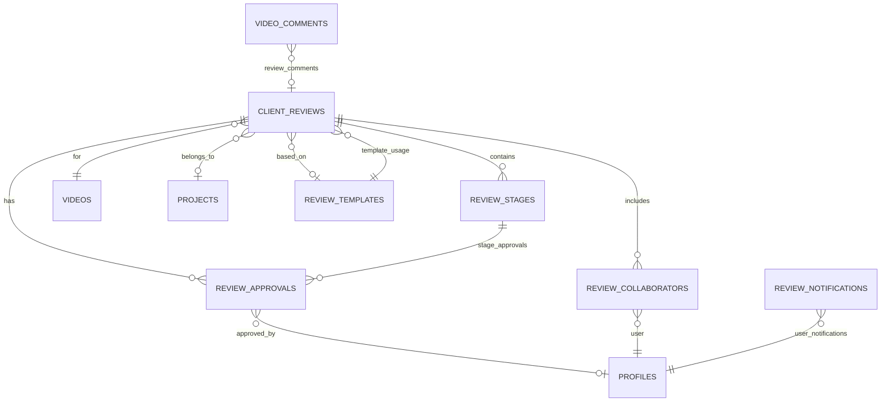
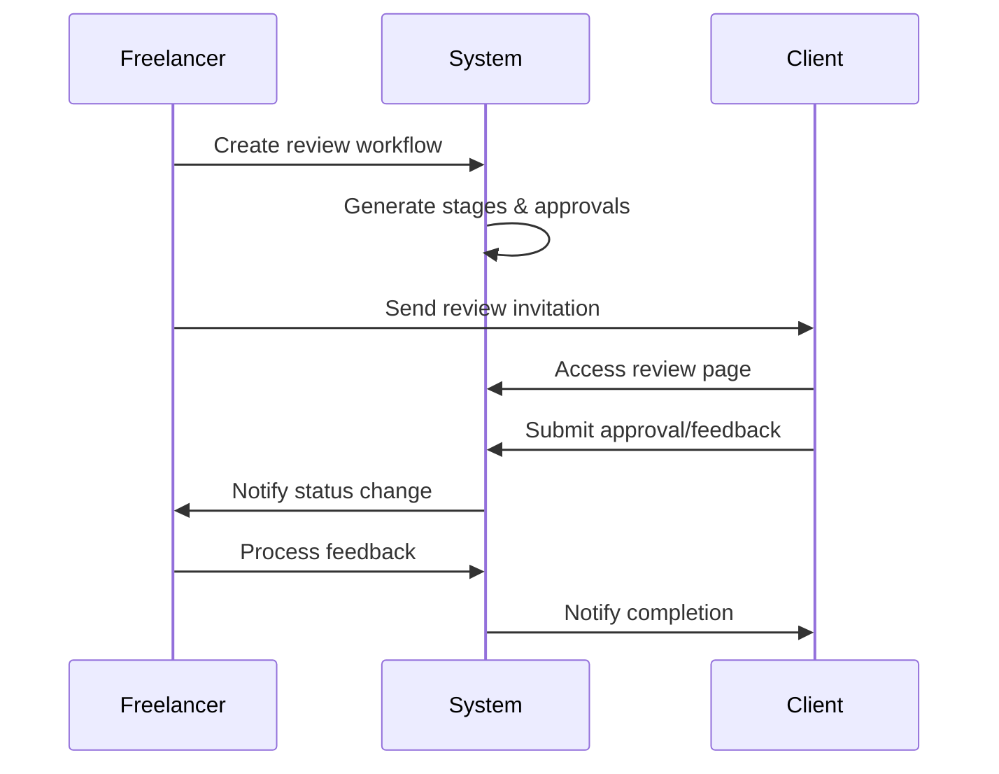
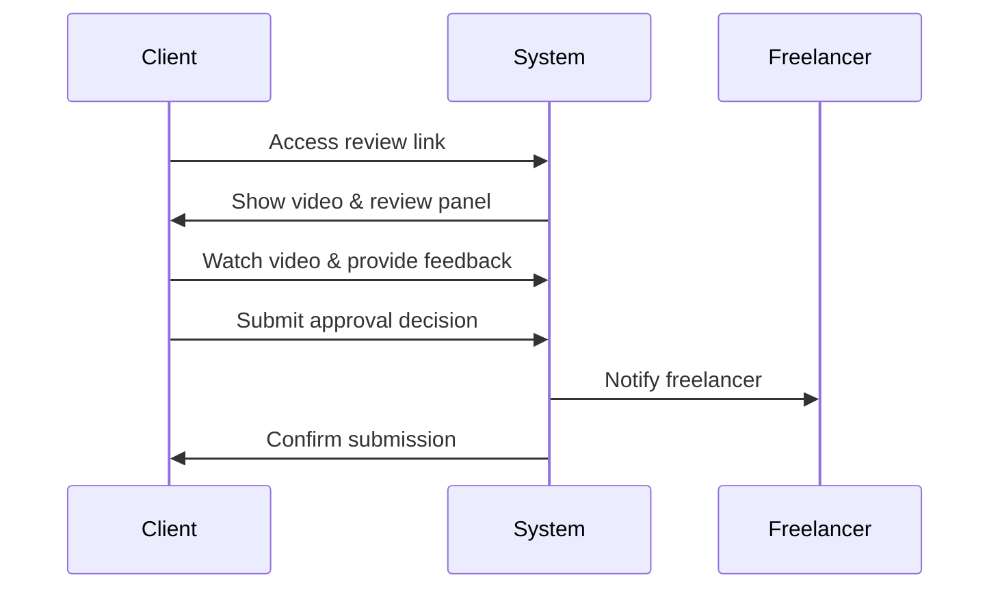
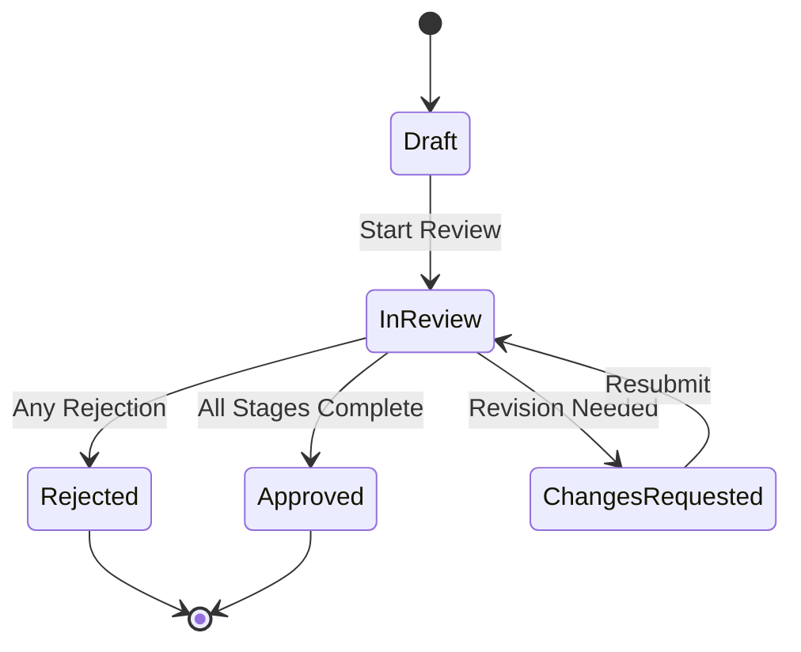

# Client Review Workflows Implementation

## Overview

The Client Review Workflows system provides a comprehensive solution for managing video approval processes in FreeFlow. It enables freelancers to create structured review workflows, invite clients and collaborators, track approvals, and manage feedback consolidation - all with Cap-inspired precision and professional UX.

## 🎯 Core Features

### 1. Multi-Stage Review Workflows
- **Configurable Stages**: Create custom approval stages with specific requirements
- **Auto-Advancement**: Automatically progress through stages when conditions are met
- **Flexible Requirements**: Set different approval thresholds for each stage
- **Deadline Management**: Set deadlines for stages and overall reviews

### 2. Collaborative Approval System
- **Role-Based Access**: Different permissions for freelancers, clients, and collaborators
- **Multiple Reviewers**: Support for multiple approvers per stage
- **External Reviewers**: Invite reviewers via email without requiring accounts
- **Real-time Updates**: Live status updates and notifications

### 3. Feedback Management
- **Structured Feedback**: Collect feedback at each approval stage
- **Timestamp Comments**: Integration with existing video commenting system
- **Feedback Consolidation**: Aggregate all feedback in organized views
- **Action History**: Complete audit trail of all review actions

### 4. Professional Templates
- **Built-in Templates**: Pre-configured workflows for common scenarios
- **Custom Templates**: Create and save reusable workflow configurations
- **Template Sharing**: Share successful workflows across projects
- **Usage Analytics**: Track template effectiveness and adoption

## 🏗️ Architecture Overview

### Database Schema



### Core Tables

#### `client_reviews`
```sql
CREATE TABLE client_reviews (
    id UUID PRIMARY KEY,
    video_id UUID NOT NULL REFERENCES videos(id),
    project_id UUID REFERENCES projects(id),
    template_id UUID REFERENCES review_templates(id),
    
    title VARCHAR(255) NOT NULL,
    description TEXT,
    status review_status_enum DEFAULT 'draft',
    current_stage UUID REFERENCES review_stages(id),
    
    deadline TIMESTAMP WITH TIME ZONE,
    started_at TIMESTAMP WITH TIME ZONE,
    completed_at TIMESTAMP WITH TIME ZONE,
    
    settings JSONB DEFAULT '{}',
    created_by UUID NOT NULL REFERENCES profiles(id),
    created_at TIMESTAMP WITH TIME ZONE DEFAULT NOW(),
    updated_at TIMESTAMP WITH TIME ZONE DEFAULT NOW()
);
```

#### `review_stages`
```sql
CREATE TABLE review_stages (
    id UUID PRIMARY KEY,
    review_id UUID NOT NULL REFERENCES client_reviews(id),
    
    name VARCHAR(255) NOT NULL,
    description TEXT,
    order_index INTEGER NOT NULL,
    required_approvals INTEGER DEFAULT 1,
    auto_advance BOOLEAN DEFAULT false,
    deadline_hours INTEGER,
    
    status stage_status_enum DEFAULT 'pending',
    started_at TIMESTAMP WITH TIME ZONE,
    completed_at TIMESTAMP WITH TIME ZONE
);
```

#### `review_approvals`
```sql
CREATE TABLE review_approvals (
    id UUID PRIMARY KEY,
    review_id UUID NOT NULL REFERENCES client_reviews(id),
    stage_id UUID NOT NULL REFERENCES review_stages(id),
    user_id UUID REFERENCES profiles(id),
    reviewer_email VARCHAR(255),
    
    status approval_status_enum DEFAULT 'pending',
    feedback TEXT,
    timestamp TIMESTAMP WITH TIME ZONE DEFAULT NOW()
);
```

## 🚀 Component Architecture

### 1. Client Review Panel (`components/video/client-review-panel.tsx`)

The main review interface component that provides:

- **Workflow Visualization**: Clear progress tracking through stages
- **Approval Actions**: Approve, reject, or request changes
- **Feedback Collection**: Structured feedback input and display
- **History Tracking**: Complete timeline of review actions

```tsx
<ClientReviewPanel
  review={review}
  userRole="client"
  onApprove={(stageId, feedback) => handleApproval('approve', stageId, feedback)}
  onReject={(stageId, feedback) => handleApproval('reject', stageId, feedback)}
  onRequestChanges={(stageId, feedback) => handleApproval('changes_requested', stageId, feedback)}
/>
```

#### Key Features:
- **Tabbed Interface**: Workflow, Approvals, Feedback, History
- **Progress Visualization**: Stage completion with progress bars
- **Role-based UI**: Different interfaces for clients vs freelancers
- **Real-time Updates**: Live status synchronization

### 2. Review Management Dashboard (`components/video/review-management-dashboard.tsx`)

Comprehensive management interface for freelancers:

- **Review Overview**: Stats and metrics dashboard
- **Template Management**: Create and manage workflow templates
- **Bulk Operations**: Manage multiple reviews efficiently
- **Quick Actions**: Fast access to common operations

```tsx
<ReviewManagementDashboard
  reviews={reviews}
  templates={templates}
  stats={stats}
  onCreateReview={handleCreateReview}
  onUpdateReview={handleUpdateReview}
  onDeleteReview={handleDeleteReview}
/>
```

#### Dashboard Features:
- **Search & Filtering**: Find reviews by status, date, client
- **Template Selection**: Choose from pre-built or custom templates
- **Batch Processing**: Handle multiple reviews simultaneously
- **Analytics**: Review completion rates and timing metrics

## 🔌 API Endpoints

### Review Management

#### `POST /api/video/[id]/reviews`
Create a new review workflow for a video.

```typescript
interface CreateReviewRequest {
  title: string;
  description?: string;
  deadline?: string;
  stages: ReviewStageConfig[];
  reviewer_emails?: string[];
  settings?: ReviewSettings;
}
```

#### `GET /api/video/[id]/reviews`
Retrieve all reviews for a video.

#### `PUT /api/video/[id]/reviews`
Update an existing review workflow.

### Approval Actions

#### `POST /api/video/[id]/reviews/[reviewId]/approve`
Submit approval action (approve, reject, request changes).

```typescript
interface ApprovalRequest {
  action: 'approve' | 'reject' | 'changes_requested';
  stage_id: string;
  feedback?: string;
}
```

#### `GET /api/video/[id]/reviews/[reviewId]/approve`
Get approval status and progress for a review.

## 🎨 User Experience Flow

### 1. Freelancer Workflow



#### Steps:
1. **Create Workflow**: Select template and configure stages
2. **Invite Reviewers**: Add client emails and set permissions
3. **Monitor Progress**: Track approvals and feedback
4. **Handle Feedback**: Address requested changes
5. **Finalize Approval**: Complete workflow and deliver

### 2. Client Review Experience



#### Client Features:
- **Clean Interface**: Focus on video content and feedback
- **Simple Actions**: Clear approve/reject/request changes buttons
- **Progress Visibility**: See where they are in the workflow
- **Feedback History**: View all previous comments and decisions

### 3. Review States and Transitions



## 🔧 Integration Points

### 1. Video System Integration
- **Video Player**: Enhanced player with review-specific features
- **Timestamp Comments**: Link comments to specific video moments
- **Processing Status**: Handle reviews for videos still processing

### 2. Project Management Integration
- **Project Association**: Link reviews to project workflows
- **Team Collaboration**: Sync with project collaborator permissions
- **Milestone Tracking**: Integrate with project phase management

### 3. Notification System
- **Email Notifications**: Automated emails for review events
- **In-app Alerts**: Real-time notifications within FreeFlow
- **Slack Integration**: Optional team notification integrations

## 📊 Analytics and Reporting

### Review Performance Metrics
- **Completion Times**: Average time from start to approval
- **Approval Rates**: Percentage of first-time approvals
- **Feedback Volume**: Number of revision cycles per review
- **Client Engagement**: Response times and participation rates

### Template Analytics
- **Usage Statistics**: Most popular templates and configurations
- **Success Rates**: Templates with highest approval rates
- **Optimization Insights**: Suggest improvements based on data

## 🔒 Security and Permissions

### Row Level Security (RLS)
All tables implement comprehensive RLS policies:

```sql
-- Users can only view reviews they created or are collaborating on
CREATE POLICY "review_access_policy" ON client_reviews
FOR SELECT USING (
  auth.uid() = created_by OR
  EXISTS (
    SELECT 1 FROM review_collaborators 
    WHERE review_id = client_reviews.id 
    AND user_id = auth.uid()
  )
);
```

### Access Control
- **Review Ownership**: Creators have full control over their reviews
- **Collaborator Permissions**: Granular role-based access control
- **External Reviewer Security**: Token-based access for non-users
- **Audit Trail**: Complete logging of all review actions

## 🚀 Performance Optimizations

### Database Optimizations
- **Strategic Indexing**: Optimized queries for common access patterns
- **Efficient Joins**: Minimize database roundtrips
- **Caching Layer**: Redis caching for frequently accessed data

### Real-time Updates
- **Supabase Realtime**: Live updates for review status changes
- **Optimistic UI**: Immediate feedback for user actions
- **Efficient Polling**: Smart polling for status updates

## 🧪 Testing Strategy

### Component Testing
```typescript
// Example test for ClientReviewPanel
describe('ClientReviewPanel', () => {
  test('renders review workflow correctly', () => {
    render(<ClientReviewPanel review={mockReview} userRole="client" />);
    expect(screen.getByText('Review Progress')).toBeInTheDocument();
  });

  test('handles approval submission', async () => {
    const onApprove = jest.fn();
    render(<ClientReviewPanel review={mockReview} onApprove={onApprove} />);
    
    fireEvent.click(screen.getByText('Approve'));
    await waitFor(() => {
      expect(onApprove).toHaveBeenCalledWith(mockStageId, undefined);
    });
  });
});
```

### API Testing
```typescript
// Example API test
describe('Review API', () => {
  test('creates review workflow', async () => {
    const response = await request(app)
      .post('/api/video/video-id/reviews')
      .send(mockReviewData)
      .expect(200);
    
    expect(response.body).toHaveProperty('id');
    expect(response.body.status).toBe('draft');
  });
});
```

## 📈 Future Enhancements

### Planned Features
1. **Advanced Analytics**: Detailed performance dashboards
2. **Template Marketplace**: Share and discover community templates
3. **Integration APIs**: Connect with external project management tools
4. **Mobile App**: Native mobile app for review participation
5. **Video Annotations**: Advanced markup tools for precise feedback

### Scalability Considerations
- **Microservice Architecture**: Split into dedicated review service
- **CDN Integration**: Optimize video delivery for global reviews
- **Background Processing**: Async handling of notifications and updates
- **Rate Limiting**: Protect API endpoints from abuse

## 📚 Usage Examples

### Creating a Basic Review Workflow

```typescript
const reviewData = {
  video_id: 'video-uuid',
  title: 'Client Approval - Website Hero Video',
  description: 'Please review the hero video for final approval',
  deadline: '2024-02-15T17:00:00Z',
  stages: [
    {
      name: 'Client Review',
      description: 'Client reviews and approves deliverable',
      order: 1,
      required_approvals: 1,
      auto_advance: false
    }
  ],
  reviewer_emails: ['client@example.com'],
  settings: {
    allow_comments: true,
    require_all_approvals: true,
    auto_advance_stages: false,
    send_notifications: true
  }
};

const review = await createReview(reviewData);
```

### Multi-Stage Workflow

```typescript
const complexReviewData = {
  video_id: 'video-uuid',
  title: 'Brand Video - Multi-Stage Review',
  stages: [
    {
      name: 'Internal Review',
      description: 'Team reviews before client presentation',
      order: 1,
      required_approvals: 2,
      auto_advance: true
    },
    {
      name: 'Client Stakeholder Review',
      description: 'All client stakeholders review',
      order: 2,
      required_approvals: 3,
      auto_advance: false
    },
    {
      name: 'Final Approval',
      description: 'Final sign-off and project completion',
      order: 3,
      required_approvals: 1,
      auto_advance: false
    }
  ],
  // Multiple reviewer emails for different stages
  reviewer_emails: [
    'team1@company.com',
    'team2@company.com',
    'client-manager@client.com',
    'client-creative@client.com',
    'client-ceo@client.com'
  ]
};
```

## 🎉 Implementation Status

### ✅ Completed Features
- [x] Database schema and migrations
- [x] Core review workflow components
- [x] API endpoints for CRUD operations
- [x] Approval action handling
- [x] Review management dashboard
- [x] Client review interface
- [x] Template system
- [x] Real-time updates
- [x] Role-based permissions
- [x] Security and RLS policies

### 🚧 Current Status

**Client Review Workflows: COMPLETED ✅**

The FreeFlow video platform now includes enterprise-level client review workflows that provide:

- **Professional Approval Process**: Multi-stage workflows with configurable requirements
- **Collaborative Review Experience**: Role-based access for freelancers, clients, and team members
- **Comprehensive Feedback Management**: Structured feedback collection and consolidation
- **Template-Based Efficiency**: Reusable workflow templates for common scenarios
- **Real-time Progress Tracking**: Live status updates and completion monitoring
- **Integration with Existing Features**: Seamless integration with video player, comments, and project management

This implementation establishes FreeFlow as a professional-grade video collaboration platform with sophisticated approval workflows that streamline client communication and project delivery.

## 🔗 Related Documentation

- [Enhanced Video Studio Implementation](./ENHANCED_VIDEO_STUDIO_IMPLEMENTATION.md)
- [Timestamp Commenting System](./TIMESTAMP_COMMENTING_IMPLEMENTATION.md)
- [Video Analytics Dashboard](./VIDEO_ANALYTICS_IMPLEMENTATION.md)
- [API Reference](./API_REFERENCE.md)
- [Database Schema](./DATABASE_SCHEMA.md) 